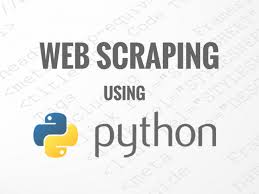
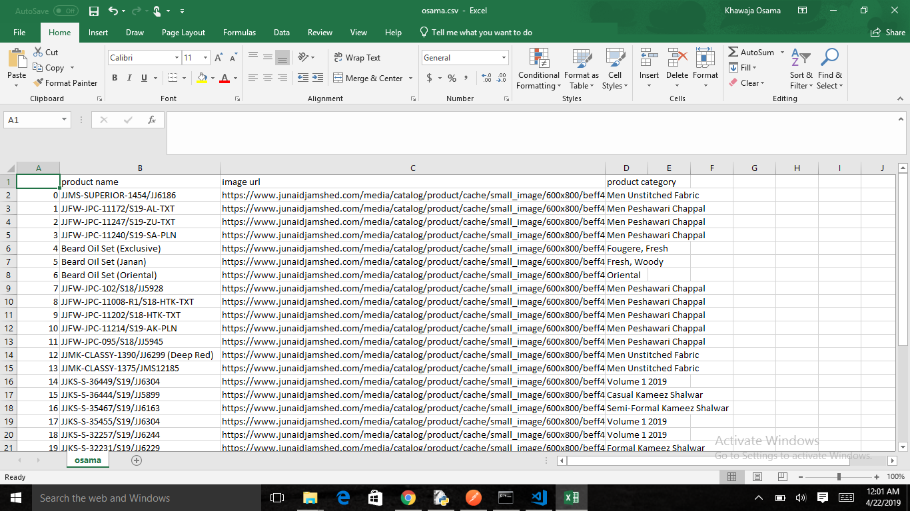
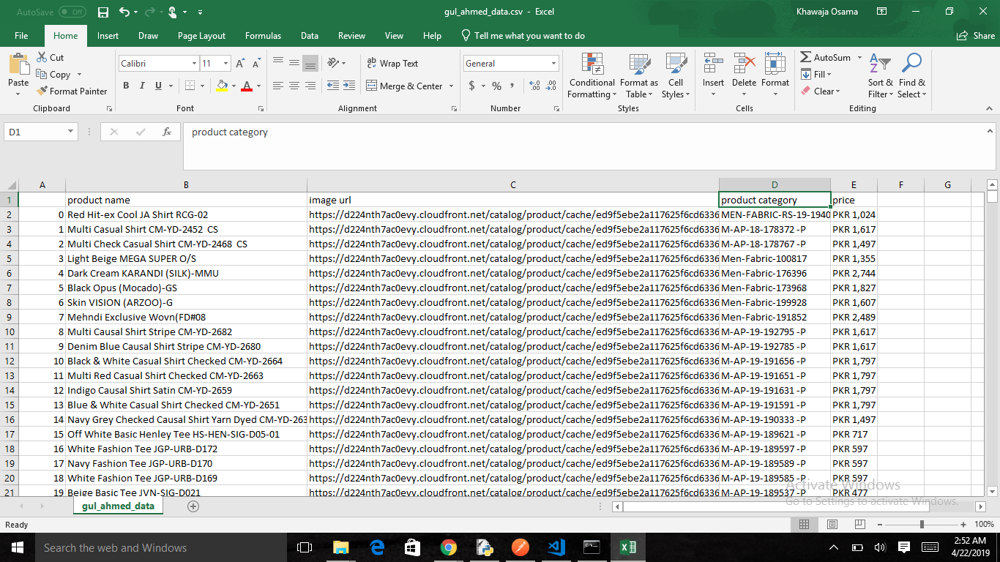

# WEB SCRAPER FOR JUNAID JAMSHED
-  `Beautiful Soup is a Python library for pulling data out of HTML and XML files`
-  `It works with your favorite parser to provide idiomatic ways of navigating, searching, and modifying the parse tree.`
-  `It is used to pull data from various websites such as Junaid Jamshed , Gul Ahmed etc.`

## REQUIREMENTS:

These are the important libraries that you will need in order to process this project:

```
- BeautifulSoap4
- requests
- Pandas
```
    
### NOTE:

You can visit on this site for [Beautiful Soap Documentation](https://www.crummy.com/software/BeautifulSoup/bs4/doc/).

## LINKS:
The Sites for Scraping are:
- Men Clothes from [Junaid Jamshed](https://www.junaidjamshed.com/mens.html).


## Data from Scraping of Junaid Jamshed:
```
 Junaid Jamshed website for scraping.
```


## Data from Scraping of Gul Ahmed:
```
 Gul Ahmed website for scraping.
```
